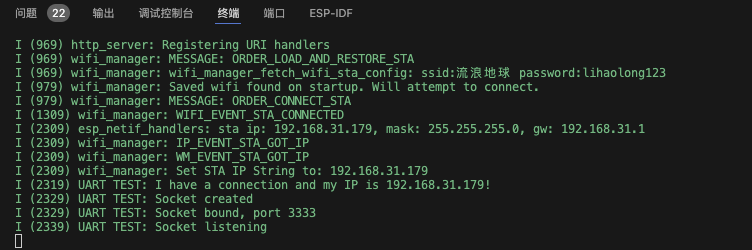

| Supported Targets | ESP32 | ESP32-C2 | ESP32-C3 | ESP32-C6 | ESP32-H2 | ESP32-P4 | ESP32-S2 | ESP32-S3 |
| ----------------- | ----- | -------- | -------- | -------- | -------- | -------- | -------- | -------- |

# ESP32_UART_SERVER

这是一个串口服务器，UART转 TCP。参考官方 UART_ECHO demo和 开源项目wifi_manager ，目前是个初级版本，还未严格测试过。
特性：
1. 支持Web 的方式进行配网(Captive Portal)。
2. 透明转发 tcp<->uart，用异步的方式进行收发。
3. TODO：支持Web 的方式进行服务端配置，包括串口波特率、串口号、TCP server 相关

## 使用说明
1. 运行后，生成一个名叫“esp32”的 WIFI 热点，用手机连接，初始密码是：esp32pwd，配置项在 components/esp32-wifi-manager/Kconfig 中。
2. 连接“esp32”热点，会弹出配置页面，按页面选择要配置的 WIFI 和密码后，完成配网。

3. 查看步骤 2 中串口打印的 esp32 IP地址(上图中是192.168.31.179)，用客户端连接即可

## 配置
1. 代码在 ESP32-WROOM-32 的模组能运行，因为相关设备未到，还未严格测试过。
2. 在其它模组中使用时，要注意 UART port和IO口的选择

## 更新日志
7.30更新：
  1. fixed：内存越界导致概率性重启
  2. 降低转发延迟由 1s 降至 10ms 级
  3. 限制一个客户端连接，超出拒绝